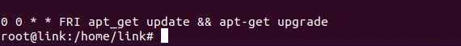
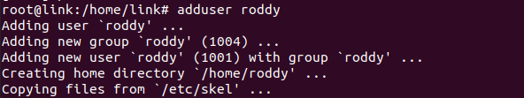
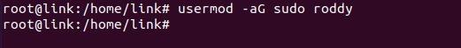
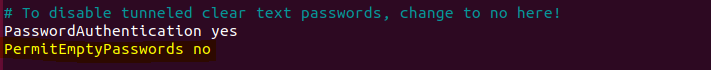
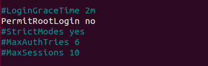
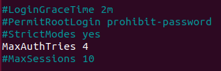
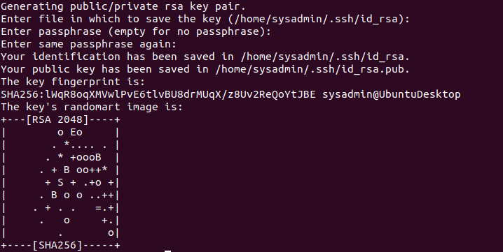
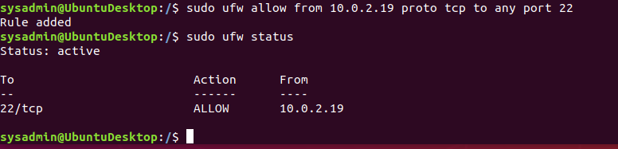
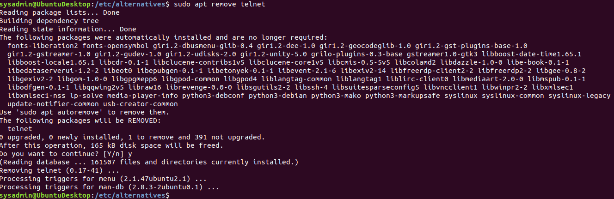

<h1 align="center"> Secure My Server </h1> <br>
<p align="center">
    
  </a>
</p>

<h1 align="center">Introduction:</h1>
<p> Most systems have some type of confidential data that needs to be protected. They hold financial information, personal photos, trade secrets, social security numbers, etc. To safeguard this data, we need to secure our important Linux systems. But how do we properly harden a Linux system? To protect against malicious actors who want to steal our precious data. If you are curious about that then this is the project for you. In this project, I will be detailing the process of hardening a Linux server. Deployed on my Local Network and i will be detailing the tools and configurations used to harden the server. For which you can apply to your very own server. </p>


<!-- START doctoc generated TOC please keep comment here to allow auto update -->
<!-- DON'T EDIT THIS SECTION, INSTEAD RE-RUN doctoc TO UPDATE -->
## Table of Contents

- Automatic Updates
- Users
- Secure SSH
- Firewalls
- Disable Vulnerable and Unused services/ports
- Isolation(Docker)


## Automatic Updates:

<p align="center">
  
</p>

### Why Automatic Updates:
- Enabling Automatic updates help keep a server upto date with the latest patches and software updates. Which will prevent outdated vulnerable applications/software on the server from being expolited by malicious actors. Which can result in malware being installed into the system which can result in data loss, stolen sensitive data, deletion, And etc.

- A way to enable Automatic Updates is to make uses of "Cronjobs" which are scheduled automatic jobs done by the server itself without user intervention. Jobs may include backups, creating reports, cleanup tasks, <b>automatic updates</b>, and more. And for my server I created a cronjob that does the following:

### This cronjob will update the server every Friday at 12 PM:
``` 0 0 * * FRI apt-get update && apt-get upgrade ```



## Users: :exclamation:

Logging in as root is bad practice it leaves the server open to accidental deletions and other mishapes caused by common user errors. So it is absolutely vital to create a User Account with limited privledges. And For my server I did the following:

### Creating User



### Adding user to sudoer group


These images show the successful creation of a user with now limited privileges.
And now that we have a user with limited privileges the server is more secure.


## Secure SSH: :closed_lock_with_key:
SSH, or Secure Shell, is a remote administration protocol that allows users securely control and modify their remote servers over the Internet. And With it, you can feel risk-free and worry-free to login to a remote computer, to execute commands in another machine, and to move files between two separate machines over the same network. But their are ways to make SSH even more secure. And for my server i configured the following:

### Making a Backup:
First, before making major changes i backed up the configuration file.

``` cp /etc/ssh/sshd_config ~/sshd_config_original ```

### Preventing Empty Passwords:
 ``` nano /etc/ssh/sshd_config ```
 
Find PermitEmptyPasswords. Uncomment it, and replace the yes value with no:

``` PermitEmptyPasswords no ```



### Preventing root login:

``` PermitRootLogin no ```



### Maximum authentication attempts
 
To protect against brute-force attacks on the password of a user, limit the number of attempts. This can be done with the MaxAuthTries setting.

``` MaxAuthTries 3 ```



### Key Based Authentication:
Key Based Authenication uses asymmetric cryptography. That means there are two keys, different but mathematically related to each other. One is private and never sent across the network. The other is public and may be transferred across the network. Because the keys are related, they can be used to confirm identities—identities such as SSH authentication attempts. And this process is much safer and less prone to brute-force attacks. Disable PasswordAuthentication to force users to use keys.

You'll need to generate the key pair on the local SSH client computer and then transfer the public key across the network to the destination SSH server. In other words, the keys will identify you on your admin workstation. Once this configuration is in place, you are no longer challenged for a password when you establish an SSH connection.

### Steps:

### Generating a key pair:

First i generated a keypair on my local server.

``` ssh-keygen ```



> Note:
The keys are stored in your home directory in a hidden directory named .ssh, and the default key names are id_rsa (private key) and id_rsa.pub (public key).

### Copying Public key over:

Now you have to transfer the public key across the network to the server.

``` ssh-copy-id -i ~/.ssh/id_rsa.pub <username>@<host> ```

## Firewalls: :fire:

<p align="center">
  
</p>


### UFW

Having a host-based firewall helps to monitor and control traffic going in and out of a single host, such as a server or a workstation. And adding host-based firewall helps to protect a sever my server in this case from untrusted external devices attempting to attack through open ports/services. So for a host based firewall I decide to use UFW the Uncomplicated Firewall.

### Limiting SSH Access 
Limiting who can attempt to ssh to the server really important for the secure of the server. Helping to prevent brute force attacks and among other password attacks.

Command: 

``` sudo ufw allow from 10.0.2.19 proto tcp to any port 22 ```




## Disable Vulnerable and unused services and ports:sudo 
It is important that unsecure services and unused services/port are disabled on the server. Because the fewer ports and vulnerable services that that are open and running on the server. The more secure the server actually is. 

### Finding open ports and unused services: 

to find unused services running on open ports the Command:

``` sudo ss -atpu ```
> Note:
> "ss" is a utility to investigate sockets.

And when i ran this command did not find anything that needed to be removed.

But when you find unused services like "postfix" for example. You want to disable or remove the said service and you do that by.

``` sudo systemctl remove <service> ```

And

``` sudo apt remove <service> ```

### Removing Telnet: 

Telnet was installed on my server and i planned to remove it because. The "Telnet" protocol was designed long back, even before the TCP/IP protocol suite. initially being designed for the computer networks of 1960’s and 1970’s. So due to its age it was not exactly design with security in mind. So traiffic between telnet client and server is unencrypted, unless a third-party encryption tool or protocol is used. so i decided to remove it.

Command: 

``` sudo apt remove telnet ```



## isolation
